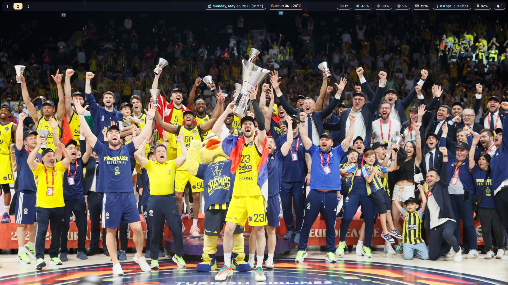

# Skyfall's hyprconfig

Hello! This is my hyprland config. You can use it however you want. 

## Screenshot



If you want to use this config, You'll need some packages.

This is the list of packages:

```
hyprland
ags-hyprpanel-git (install this with aur or look this link https://github.com/Jas-SinghFSU/HyprPanel)
alacritty
ubuntu nerd fonts (both normal and mono fonts)
rofi
hyprlock
hypridle
hyprpaper
wlogout
cliphist
wl-clipboard
dolphin
bibata-cursor-theme
kde polkit agent
Catppuccin Mocha Red gtk and qt themes
kvantum
qt6ct 
swww (for hyprpanel)
yay (to install aur packages but you can use paru if you want)
font awesome fonts
zsh (with oh my zsh)
```

I'll make a setup script when I'm available.
